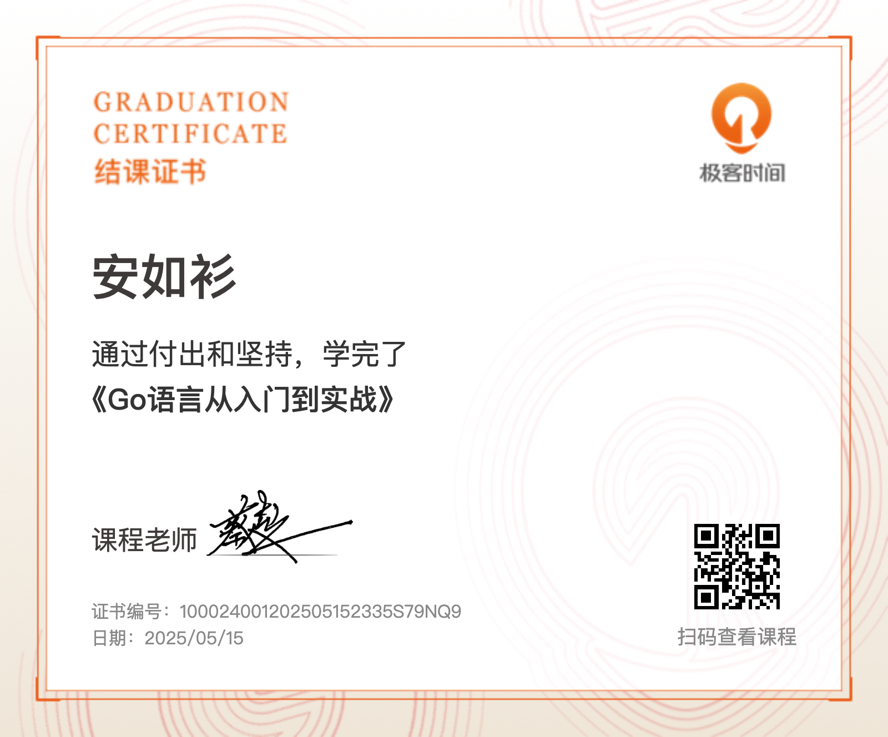

# golang-from-scratch

> 本仓库紧跟 Go 1.24 的语言演进，采用现代写法与最佳实践，并通过 golangci-lint 保证代码规范。觉得还不错的话，点个 🌟 叭！

## 语法基础

- `./basics` 包含 Go 语言的基本语法样例代码，避免陷入其他主流语言思考模式的固有陷阱：
    - ⚙️ 基础结构：常量、变量、条件、循环、字符串、slice、map
    - 🌆 抽象：结构体、接口
    - 🤕 错误处理与测试：单元测试、benchmark、BDD、json 性能调优
    - 🏗️ 架构设计：微内核、管道过滤器
    - ⚡️ 并发基础：mutex、waitgroup、channel 等
    - 🐯 `exercises` 和 `proj` 包含来自 HeadFirst, gophercises, 新未来训练营 等练习/考核的 Solutions

## 工程进阶

- `./advanced` 包含 Go 语言进阶语法和工程实践的样例代码和文档，助你从从熟练到精通：
    - 🔍 进阶语法和新版本新特性：反射、泛型、atomic、context、slog 等新特性和实用包
    - 🧩 设计模式：装饰器模式、观察者模式等
    - 🏙️ 工程实践：项目布局、接口设计的艺术、缓存方案、依赖注入、可观测性等

## 优质在线资源

- The Uber Go Style Guide：https://github.com/uber-go/guide/blob/master/style.md
- Go语言从入门到实战：https://gitee.com/geektime-geekbang/go_learning
- Docker 训练营: https://opencamp.ai/Docker/camp/202501
- Go并发编程：https://katherine.cox-buday.com/concurrency-in-go/

## 里程碑留念

