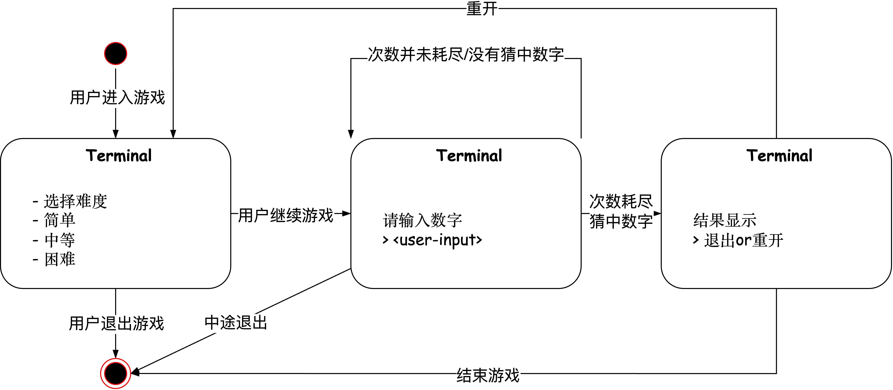

# 启动方式


## 安装依赖包

```bash
go get numguess
```

## 运行代码

```bash
go build . && ./numguess
```

# 设计文档

## 需求分析

设计并实现一个终端交互的数字猜谜游戏。

### 功能需求

- [ ] 支持用户选择不同难度（简单/中等/困难），对应不同的尝试次数。
- [ ] 在命令行输入猜测数字，系统给予相应提示（大于、小于、正确）；用户需在限定次数内猜中随机数字，猜中为胜，超过次数为失败。
- [ ] 每轮游戏结束后允许用户选择继续或退出游戏。
- [ ] 自动记录每次猜测及每轮游戏的开始和结束时间，计算游戏耗时。
- [ ] 游戏数据持久化，每轮游戏记录存储至本地`txt`文件（包含开始结束时间、目标数字、用户猜测序列及游戏结果）。
- [ ] 具备清晰的模块划分，采用良好的交互架构设计。

### 安全需求

- [ ] 必须对用户输入进行合法性校验（数字范围1-100）。

---

## 技术选型

为了实现更现代化、友好的CLI交互体验，同时满足自定义退出按键的需求，我们需要引入第三方库。经网络调研，有两个主要选择：

- [promptui](https://github.com/manifoldco/promptui)
    - 优点：API 使用简单，入门快
    - 缺点：长期未维护，不支持自定义退出键

- [bubbletea](https://github.com/charmbracelet/bubbletea)
    - 优点：社区活跃，架构灵活（Model/Action/View），易扩展，适合现代TUI设计。
    - 缺点：文档无中文版，需设计按键交互逻辑

综合以上分析，考虑到产品交互体验和技术扩展性，我们选择 **bubbletea** 实现本次TUI游戏。

---

## 概要设计


bubbletea 采用 MVU（Model-View-Update） 架构（又称Elm架构）。
- Model：定义状态数据结构。
- View：视图仅基于 Model 渲染 UI。
- Update：用户输入触发消息，更新 Model，进而重新渲染 View。

所有的UI更新基于数据状态驱动，数据与展示分离，视图仅根据数据展示。

首先需要明确游戏不同页面之间的跳转逻辑。参照安卓的Navigation Graph设计模式，我们得到以下页面关系图：



我们因此定义页面状态码`status_code`： welcome（欢迎）、playing（游戏）
、win（胜利） 、lose（失败）。

---

## 详细设计

游戏数据与交互逻辑的设计决定了页面渲染方式。因此，我们抽象出游戏的状态数据结构，并根据UI显示需求，分为三个视图组件：

- header（页头）
- content（主体内容）
- footer（页脚提示信息）

页面UI设计视图模型如下图：
接下来，我们通过对页面的分析导出状态（数据结构）应存储的字段。

### 欢迎页面设计

- **Header**：欢迎语句，引导用户进入游戏（静态，与视图相关）。
- **Content**：提供难度选择列表。（难度可尝试次数设计为结构体`level`，以切片形式`[]level`保存，相比起静态写死，更便于扩展和修改。）
- **Footer**：提示用户使用方向键选择难度并按Enter确认。进入游戏页面并切换状态码为`playing`。

还希望用户通过方向键控制光标移动，光标（需要`cursor`变量指示当前选项）。

### 游戏页面设计

- **Header**：显示当前游戏进度和剩余尝试次数（要达到这一点，同时有考虑到后续需要历史记录存储，我们采用`guessTrace []int`
  保存用户的临时提交顺序，这样的设计能为后续带来很多的便利）
- **Content**：
    - 提供用户输入框，并即时进行合法性校验（需要一个`errMsg`标明当前状态下的警告信息，每当用户有新的动作，警告信息应当清空）。
    - 每次输入时，更新`guessTrace`存储用户猜测序列。
    - 对每次输入实时进行校验并展示错误提示信息（如非数字`j`或数字越界`0`）。
    - 按下Enter后，提供即时反馈提示（大于/小于），便于用户判断输入方向。并更新状态码。
- **Footer**：展示操作按键提示。

设计取舍：

- 数据模型中是否需要添加 `hint` 字段来存储"大/小/等"提示信息？
- 从**模型-视图职责分离**原则出发，`hint`字段应作为视图层的派生状态而非模型层的主状态。 核心模型只需维护`target`和
  `guessTrace`这两个原子事实，通过`guessTrace[len(guessTrace) - 1]`与`target`
  的数值关系，视图层可自主推导出提示信息的语义表达和视觉呈现。这种设计既符合「业务逻辑内聚于Model，表现逻辑归属于View」的架构规范，也避免了模型层与视图层的状态耦合。

---

### 结果页面设计

- **Header**：明确提示用户输赢结果。
- **Content**：展示用户尝试次数和本次游戏耗时（需要添加`ticTime`和`tocTime`分别代表开始时间和结束时间）。
- **Footer**：询问用户是否继续游戏，提供明确的按键提示。

---

### 重开与数据持久化设计

每次用户重开新局，通过调用`newModel()`快速初始化游戏状态。每轮游戏结束后，需要将以下信息记录至本地文件：

- 游戏开始和结束时间戳（计算游戏耗时）
- 随机生成的目标数字`target`
- 用户猜测序列`guessTrace`
- 游戏最终结果（胜利或失败）

虽然JSON格式在可扩展性（如未来支持历史胜率统计）和结构化数据处理方面更具优势，但根据需求约束条件和最小复杂度原则，需求规格执行采用TXT文件实现数据持久化。