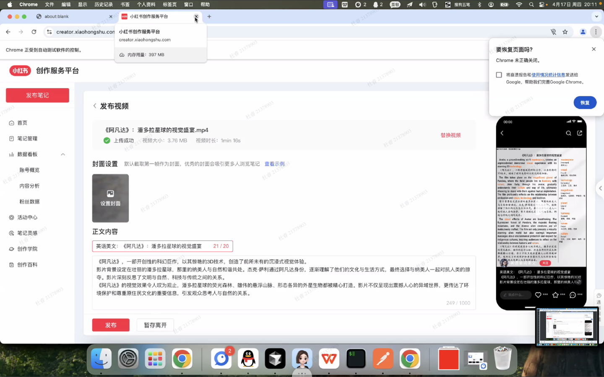

## 0. Unicode 与 UTF-8 的关系

- **Unicode**：统一字符编码标准，每个字符对应一个码点（如`U+4E2D`）。
- **UTF-8**：Unicode的变长编码实现方式，占1~4个字节，兼容ASCII。
- ✅ 优势：ASCII字符用1字节，兼容性好。

## 1. HTTP 协议和“文本”的本质

- HTTP是**超文本传输协议**，但body可为任意**二进制**数据。
- 文本 vs 二进制的界限取决于**解析方式**，浏览器依据Content-Type判断。

## 2. 无状态特性与 Cookie 伪状态

- HTTP 是无状态协议。
- **Cookie / Session / Token** 模拟状态，为用户身份维持。

## 3. POST 删除 vs DELETE 区别

| 方法     | 幂等性 | 请求体 | 语义表达         |
|--------|-----|-----|--------------|
| DELETE | ✅   | 通常无 | REST风格清晰     |
| POST   | ❌   | 通常有 | 动作由body和路径决定 |

示例：

```http
DELETE /users/123
```

```http
POST /deleteUser
{
  "userId": 123
}
```

## 4. 跨域三要素

- 三要素：**协议、域名、端口**
- 满足其中任一不同即为跨域。

## 5. 锚点对服务端不可见

- `http://xx.com/page#section1` 中 `#section1` 是浏览器内部跳转，**不会传给服务端**。

## 6. Accept / Accept-Encoding 的意义

- 告诉服务器客户端能接受什么格式：
    - `Accept: application/json`
    - `Accept-Encoding: gzip`
- 有助于服务端内容协商（Content Negotiation）。

## 7. POST 请求头中 Content-Length / Content-Type 的必要性

- **Content-Length**：字节长度，帮助服务端读取。
- **Content-Type**：告诉服务端如何解析字节流（JSON / Form / Binary等）。

> 核心理解：HTTP body 是纯二进制，类型只是“**视图**”。

## 8. DNS = 把域名解析为 IP

- 比如 `ping www.baidu.com`，背后是解析出一个IP地址。
- DNS = “互联网的电话簿”。

## 9. 状态码简介

| 状态码 | 含义 |
|--||
| 200 | OK |
| 204 | 无内容，常用于数据上报 |
| 301/302 | 重定向 |
| 403 | 权限不足 |
| 404 | 资源未找到 |
| 500 | 服务端错误 |

## 10. 前端性能关注点：Waiting for Response

- `Waiting (TTFB)` > 5ms 一般为性能瓶颈（请求已发出但未响应）。
- 优化方向：
    - SSR：首次加载快，SEO 友好
    - CSR：交互快，首次加载慢

# 联调技巧与健壮性设计

1. **Copy as cURL/HAR**：复现问题直接运行。
2. **Replay 请求**：无需刷新页面即可重放。
3. **模拟弱网**：用 DevTools 设置 network condition。
4. **前端不能假设服务端永远正常**：
    - 防止接口挂掉渲染空白页。
    - 非正常用户（爬虫、攻击）也会访问你的系统。

# 分布式 & 云

- **OSS/CDN结构**：
    - OSS（对象存储）作为源站。
    - CDN 边缘加速，缓存热点资源。
    - 推荐配置合理的 Cache-Control。

# HTTPS

- 通过修改返回包 body 内容插入广告。
- 即使 body 是二进制也可通过中间人解密修改（若无HTTPS）。

- **TLS握手阶段**：
    1. 非对称加密（RSA/ECDSA）交换密钥。
    2. 建立对称密钥。
- **数据传输阶段**：
    - 用对称加密（AES/GCM）高效加密通信。

| 阶段 | 加密类型 | 目的     |
|----|------|--------|
| 握手 | 非对称  | 安全交换密钥 |
| 传输 | 对称   | 性能优先   |


## 协商缓存（Conditional Requests）

### 过程：

- **首次访问：** 返回 `200 OK`，附带：
    - `Last-Modified`
    - `ETag`（资源指纹）

- **再次访问：** 浏览器带请求头：
    - `If-Modified-Since`
    - `If-None-Match`
    - 服务端对比：
        - 没变 → 返回 `304 Not Modified`
        - 变了 → 返回 `200 OK` + 新资源

### ❓是否访问数据库？

- 视业务逻辑而定：
    - 如果缓存策略设置在**应用层**（如数据级ETag），**会查数据库**。
    - 如果是**静态资源层面**（如图片、CSS），可能不查。

## 静态资源缓存（强缓存）

- 利用 HTTP 响应头：
    - `Cache-Control: max-age=31536000`（秒）
    - 配合 Webpack 构建产物名加入哈希，如 `app.3fa9f.js`

- ⚠️ 文件变更 → 文件名变 → 浏览器视为新资源。

## Cookie + Session（早期方式）

1. 登录成功 → 服务端生成 session-id，存 redis。
2. 浏览器保存 `Set-Cookie: session-id=xxxx`。
3. 之后请求自动携带 `Cookie: session-id=xxxx`。
4. 服务端用 session-id 查 redis 取用户身份。

## 验证码逻辑（防自动提交）

1. 后端生成图片 + 验证码字符串。
2. 字符串写入 redis（带过期时间）或绑定 session。
3. 图片Base64返回前端展示。
4. 用户提交验证码 → 服务端比对 redis/session 中的值。

# 分布式场景：唯一标识与性能

- **数据库不适合做唯一性检查**（如手机号注册）：
    - 容易形成写热点 + 无法扩展。
- 替代方案：**Redis**做唯一性检测 + 原子操作：

# 请求头结构：multipart/form-data

- 用于上传表单 + 文件时。
- 每部分用 `boundary` 分隔：
    - 每段带独立的 `Content-Disposition` 和 `Content-Type`

示例：

```http
Content-Type: multipart/form-data; boundary=----WebKitFormBoundaryX
```

# HTTP 重定向区别

| 状态码 | 含义    | 使用场景      |
|-----|-------|-----------|
| 301 | 永久重定向 | 域名迁移、SEO  |
| 302 | 临时重定向 | 未登录跳转、活动页 |

# 折腾

- **产品点子：**
    - SQLite 存储 + AI生成内容
    - 通义千问 / GPT 接口调通
    - 自动发布到小红书 / 抖音

- **目标场景：**
    - 输入一个关键词 → 自动生成图文/视频 → 自动发布
    - 核心价值：内容生成自动化 + 流量验证闭环




# 项目/课程作业设计（AI、自动化方向）

## 格式建议

- 文档用 **Markdown**
- 数据交互 / 配置用 **JSON**
    - 示例 demo 可以放在提示词中，但要考虑其**稳定性差异**