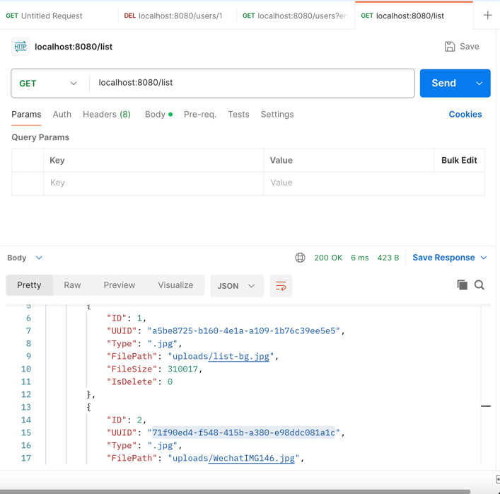
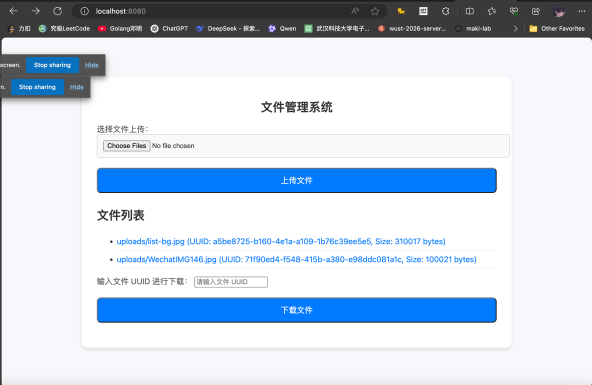

# 如何运行

```bash
go run main.go
```

你可以在 `Postman` 中进行测试，也可以在 `localhost:8080` 进行可视化交互；目前暂不支持删除。

| Postman                      | Web                      |
|------------------------------|--------------------------|
|  |  |

# 架构设计

> 框架代码使用《服务端课件（第 5 章 第 3
> 节）》文件管理系统：https://campus.wps.cn/contentpreview/c6fa8ff9-f31d-400e-8ed6-11ebc310ed20

- UI 层：用框架代码中的 html 文件，在 `templates/` 下
- 表现层：Gin 框架，提供HTTP接口，在 `api/web/files` 下
- 数据存储层：持久化存储，在 `internal/storage` 下

> 出于职责分离的考量，我认为 uuid 的生成是数据存储层需要承担的部分。

配置层贯穿各层之中，例如，config 包中设置了最大文件的大小。

# ORM 数据操作设计

我们采用 gorm 框架，避免使用原声 SQL 语句编程。暂时不考虑删除。

#### 表定义 (`Item`)

```go
type Item struct {
ID       uint   `gorm:"primaryKey;autoIncrement"`
UUID     string `gorm:"unique"`
Type     string `gorm:"type:text"`
FilePath string `gorm:"type:text"`
FileSize int64  `gorm:"type:int"`
IsDelete int    `gorm:"default:0"`
}

```

#### API 设计

### 主要功能

| 功能               | 描述                         | 方法签名                                                |
|------------------|----------------------------|-----------------------------------------------------|
| **初始化数据库**       | 初始化数据库连接，并执行表结构迁移。         | `func InitDB() *gorm.DB`                            |
| **插入文件**         | 插入文件记录，生成唯一的 UUID 并保存文件信息。 | `func InsertItem(item Item) error`                  |
| **分页查询文件**       | 分页查询未删除的文件列表。              | `func ListItem(page, pageSize int) ([]Item, error)` |
| **根据 UUID 查找文件** | 根据 UUID 查找对应的文件。           | `func FindItemByUUID(uuid string) (*Item, error)`   |

# HTTP 接口设计

| HTTP API    | Usage                                                 |
|-------------|-------------------------------------------------------|
| `/upload`   | 上传多文件（文件名/文件类型/文件大小/生成uuid），将文件存储至当前目录的 `uploads` 文件夹 |
| `/list`     | 文件列表，需支持分页（JSON: pageSize），支持按文件类型查询（JSON: fileType）  |
| `/download` | 下载文件，根据文件的唯一标识符下载文件，下载时要还原为原始文件名                      |
| `/info`     | 统计接口，返回文件综述，文件总大小，各个文件类型的数量和总大小                       |

## upload 上传接口

#### 1. 请求 URL

```
POST /upload
```

#### 2. 请求参数

- **Content-Type**: `multipart/form-data`
- **字段**: `files`（支持多文件）

#### 3. 响应格式

##### 成功

**HTTP 200 OK**

```json
{
  "code": 0,
  "msg": "success",
  "data": [
    {
      "filename": "file1.jpg",
      "path": "uploads/file1.jpg"
    }
  ]
}
```

##### 错误

- 文件超大

```json
{
  "code": -1,
  "msg": "File file1.jpg is too large. Max size is 5MB."
}
```

- 文件类型不允许

```json
{
  "code": -1,
  "msg": "Extension .exe not allowed"
}
```

- 保存失败

```json
{
  "code": -1,
  "msg": "Failed to save file file1.jpg"
}
```

## list 查询接口

#### 1. 请求 URL

```
GET /list
```

#### 2. 请求参数

- **page_num**（可选）: 查询页码，默认值为 `1`
- **page_size**（可选）: 每页返回的数据量，默认值为 `10000`

#### 3. 响应格式

##### 成功

**HTTP 200 OK**

```json
{
  "code": 0,
  "msg": "success",
  "data": [
    {
      "filename": "file1.jpg",
      "path": "uploads/file1.jpg"
    },
    {
      "filename": "file2.png",
      "path": "uploads/file2.png"
    }
  ]
}
```

##### 错误

- 数据库查询失败

```json
{
  "code": -1,
  "msg": "DB failed to list items: [error details]"
}
```

## download 下载接口

#### 1. 请求 URL

```
GET /download
```

#### 2. 请求参数

- **uuid**（必填）：文件的唯一标识符（UUID）

#### 3. 响应格式

##### 成功

**HTTP 200 OK**

- 返回文件下载响应，文件将被作为附件下载。

##### 错误

- **参数无效**

```json
{
  "code": -1,
  "msg": "invalid argument: uuid is required"
}
```

- **数据库查找失败**

```json
{
  "code": -1,
  "msg": "DB failed to find the item by UUID <UUID>: <error details>"
}
```

- **文件路径无效**

```json
{
  "code": -1,
  "msg": "Invalid file path for UUID <UUID>"
}
```