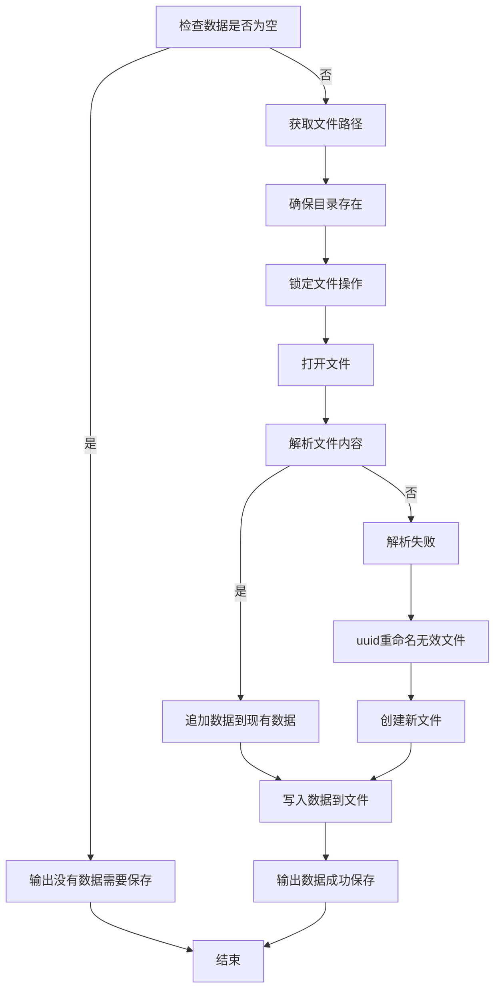

# 如何运行

首先，需要在项目根目录下创建 `.env` 文件，内容如下：

```
DASHSCOPE_API_KEY=<your_api_key>
```

然后，执行以下命令：

```bash
go run main.go
```

然后，向该接口发送请求，你可以使用 Postman 或者 curl 等工具。


# 架构设计

- 接入层：提供 HTTP 接口，接收用户请求并进行参数校验。
- 服务层：提供核心业务逻辑，这里实现的是问题创建。
- 适配层：针对第三方服务进行适配，调用不同的第三方服务。
- 数据操作层：负责数据的存储和查询。

# 接口设计

我们将问题生成抽象为一个接口，任何第三方服务都可以实现该接口，从而实现代码复用。

```go
// 接口（问题生成、解析）
type ProgrammingQuestionGenerator interface {
Generate(keyword string, language string, questionType QuestionType) (ProgrammingQuestion, error)
}

type ProgrammingQuestionParser interface {
Parse(content string) (ProgrammingQuestion, error)
}
```

我们还设计了一个 `ErrorGenerator` 接口，它增强了错误处理的通用性，避免在某些错误情况下需要特别处理返回值。

```go
var ErrModelNotFound = errors.New("model not found")

type ModelNotFoundGenerator struct{}

func NewModelNotFoundGenerator() *ModelNotFoundGenerator {
return &ModelNotFoundGenerator{}
}

func (d *ModelNotFoundGenerator) Generate(keyword string, language string, questionType QuestionType) (ProgrammingQuestion, error) {
return ProgrammingQuestion{}, ErrModelNotFound
}
```

考虑到提示词不一定是 Generator 的职责，我们将其抽象为一个模板函数，并通过不同的 `New` 方法来方便代码复用。

```go
type DashScopeGenerator struct {
baseURL        string
apiKey         string
model          string
sysPrompt      string
userPromptFunc func (k string, l string, t QuestionType) string
}

func NewDashScopeGenerator(apiKey string, model string) *DashScopeGenerator {
return &DashScopeGenerator{
baseURL: "https://dashscope.aliyuncs.com/compatible-mode/v1/",
apiKey:  apiKey,
model:   model,
sysPrompt: "你是一个互联网行业技术专家，请根据需求出题。" + `以 JSON 的形式输出，输出的 JSON 需遵守以下的格式：
{
  "title": <题目，例如，Go 语言中关于变量的自增和自减操作，下面语句正确的是？>,
  "answers": <选项数组，例如，["i := 1; i++","i := 1; j = i++","i := 1; ++i","i := 1; i--"]>,
  "right": <正确选项下标数组，例如，[0, 2]>
}`,
userPromptFunc: func (k string, l string, t QuestionType) string {
if t == SingleChoice {
return fmt.Sprintf("请针对%s，出%s一道语言的单选题，选项数目控制在4个，不多不少", k, l)
}
return fmt.Sprintf("请针对%s，出一道%s语言的多选题，选项数目控制在4个，不多不少", k, l)
},
}
}
```

# 测试驱动开发

每个模块中，我们首先考虑编写单元测试代码，再正式编写程序，以增强代码的正确性和稳定性。

## 适配层

我们认为适配层无需考虑 `model/type/language/keyword` 的合法性，只需确保正确调用大模型并能返回结果。

测试需要关注：模型选择是否正确（如 `qwen-turbo` 的返回结果较差），是否能解析大语言模型返回的格式（如大模型返回带有
` "```json <content> ```" `），以及提示词是否得当。

我们特别关注以下两种情况：

1. 通义模型返回时，可能携带 ` "```json <content> ```" `，而 `deepseek` 大概率不会；因此需要通过 Parser 使用正则表达式提取内容。
2. 通义模型对长背景提示词的理解较弱，最好将任务在提示词结尾重复。例如，以下提示词会导致通义模型无法区分单选题和多选题，从而无法正确返回结果。

## 服务层

在这里，我们需要对用户输入进行校验。虽然在代码中进行校验是一种方式，但基于代码简洁性的考虑，我们不应支持大小写转换、额外空格等情况。既然已经提供了规定的格式，不合法的输入将不予考虑，交由
Gin 框架的 `shouldBind` 来进行校验，并通过 `tag` 设置。

```go
type Args struct {
Model        string `form:"model" json:"model" binding:"omitempty,oneof=deepseek tongyi"`
Language     string `form:"language" json:"language" binding:"omitempty,oneof=go javascript java python c++"`
QuestionType uint   `form:"type" json:"type" binding:"omitempty,oneof=1 2"`
Keyword      string `form:"keyword" json:"keyword" binding:"required"`
}
```

对于缺省值需要进行处理：

```go
func setDefaults(a *Args) {
if a.Model == "" {
a.Model = "tongyi"
}
if a.Language == "" {
a.Language = "go"
}
if a.QuestionType == 0 {
a.QuestionType = 1
}
}
```

> 注意，该函数的执行在 `shouldBind` 之后。

同时，我们设计了一个专门的中间件用于计时和文件存储，以遵循职责分离和可维护性的原则。

## 数据操作层

这一层负责将结果存储，需考虑文件夹不存在、数据损坏等异常情况。

